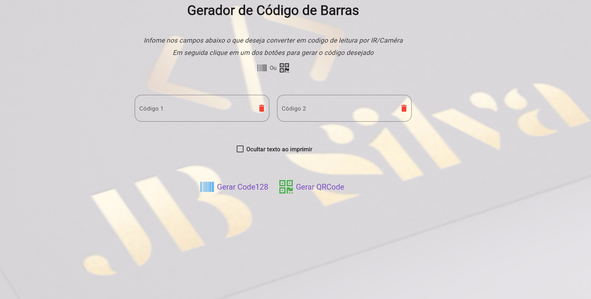
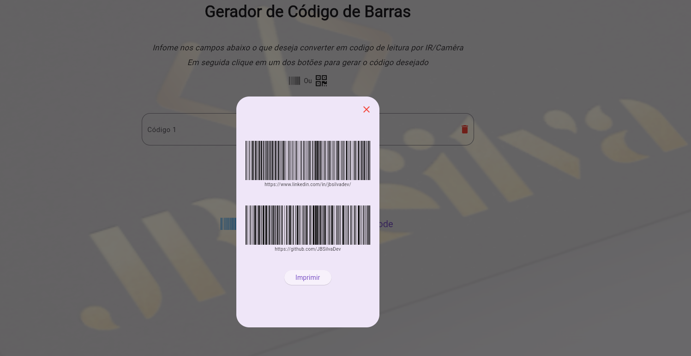
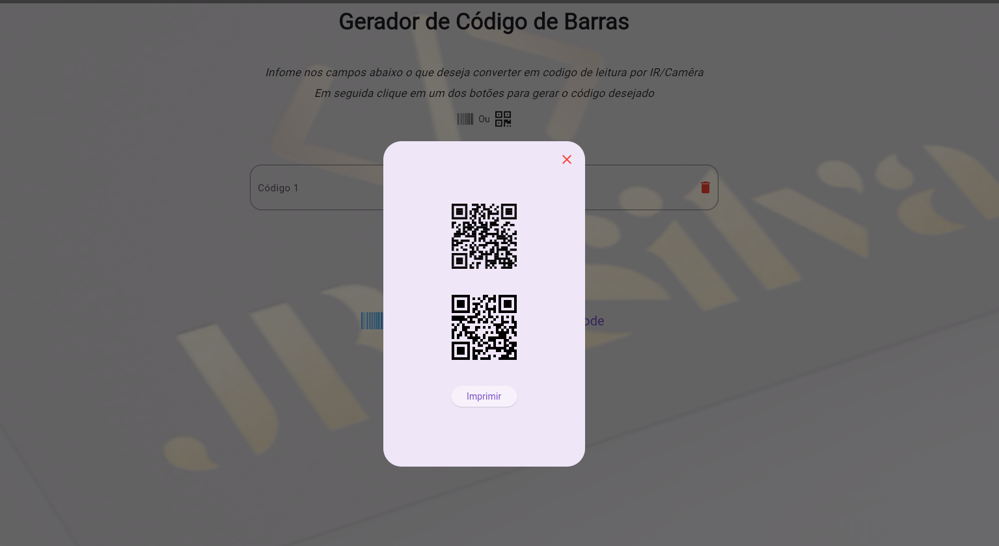
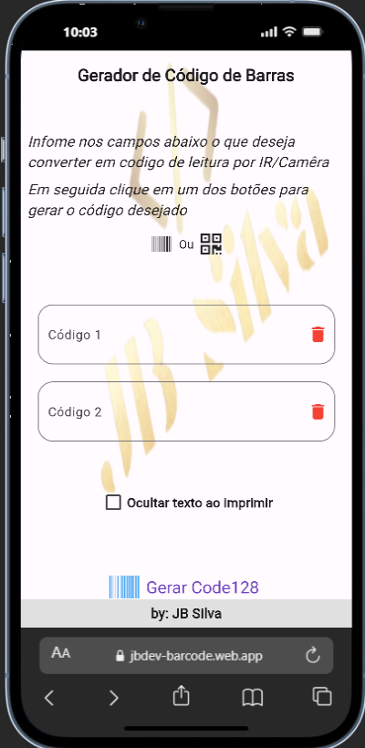
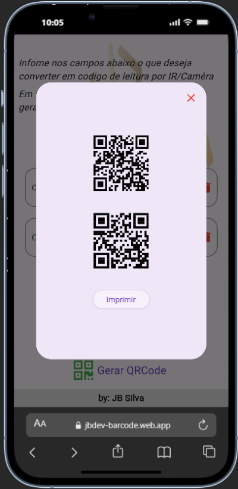

# Barcode Generator

Este é um aplicativo simples, multiplataforma (Web, Android e iOS), construído com Flutter para gerar e exibir códigos de barras.

## 🚀 Funcionalidades

-   Geração de códigos de barras a partir de uma entrada de texto.
-   Exibição do código de barras gerado em múltiplos formatos.
-   Impressão do código de barras em formato PDF.
-   Design responsivo para uma experiência consistente em dispositivos móveis e web.

## 📸 Telas

### Web
> [Acesse aqui](https://jbdev-barcode.web.app/#/)
| Tela Principal | Popup de Impressão | PDF Gerado |
| :---: | :---: | :---: |
|  |  |  |

### Mobile
| Tela Principal | Popup de Impressão | Opções de Compartilhamento |
| :---: | :---: | :---: |
|  |  |  |


## 🛠️ Tecnologias e Pacotes

Este projeto utiliza o Flutter e os seguintes pacotes principais:

-   [barcode_widget](https://pub.dev/packages/barcode_widget): Para a geração dos widgets de código de barras.
-   [printing](https://pub.dev/packages/printing): Para a funcionalidade de impressão e compartilhamento em PDF.
-   [pdf](https://pub.dev/packages/pdf): Para criar os documentos PDF para impressão.

## ⚙️ Como Executar o Projeto

1.  **Clone o repositório:**
    ```bash
    git clone https://github.com/julianobrasil/barcode_generator.git
    cd barcode_generator
    ```

2.  **Instale as dependências:**
    ```bash
    flutter pub get
    ```

3.  **Execute o aplicativo:**
    ```bash
    flutter run
    ```
    Selecione o dispositivo desejado (Chrome para web, ou um emulador/dispositivo físico para Android/iOS).

## 📂 Estrutura do Projeto

A estrutura de pastas do projeto segue o padrão do Flutter, com os principais arquivos localizados em `lib/`:

```
lib/
├── botoes/
│   └── generator_buttom.dart   # Botão de geração
├── campo_texto/
│   └── forms_text.dart         # Campo de formulário para entrada de dados
├── cod_barras/
│   └── generetor_widget.dart   # Widget que exibe o código de barras
├── home_page/
│   ├── home_page.dart          # Tela principal da aplicação
│   ├── popup.dart              # Lógica do popup de impressão
│   └── print.dart              # Lógica de geração de PDF e impressão
├── widget/
│   └── icons_barcode_icons.dart # Ícones customizados
└── main.dart                   # Ponto de entrada da aplicação
```

---
Feito por [JB Silva](https://jbsilva.netlify.app/)